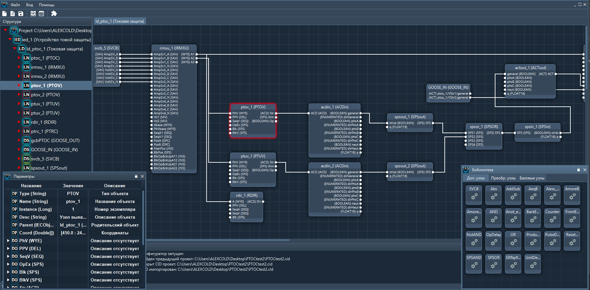

# OpenIEDconfigurator
Open IED Configurator IEC 61850
Program for making RPA based on IEC 61850. 
Project is contains new CLD (Configured Logic Description) file, which allows making connections between logical nodes and represented it in GUI

Версия 0.93 изменения
1. Доработана библиотека
2. Добавлены кнопки главного меню
3. Доработна объектная модель
4. Мелкие исправления 

Версия 0.92 изменения
1. Улучшен редактор уставок
2. Добавлена поддержка СПЛ
3. Изменена структура объектной модели
4. Множжество мелких исправлений

Версия 0.91 изменения
1. Добавлен редактор уставок
2. Добавлена синхронизация уставок CLD

Версия 0.9 изменения
1. Добавлена поддержка CLD
2. Расширена обьектная модель DO 
3. Мелкие исправления

Список работ
1. Добавить элементы преобразования данных